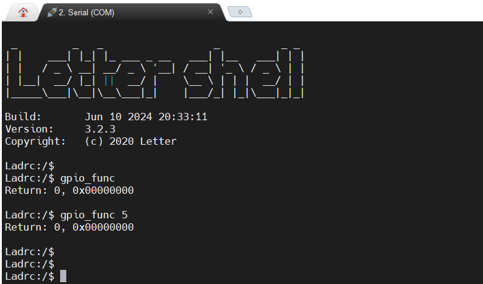

# LADRC_Board板载外设使用与测试示例

[TOC]

## 简介

本文档主要介绍LADRC_Board板载外设的使用与测试示例。

## 测试用例

### 1. gpio_sample.c

1. 测试目标

   该测试用例提供了板载LED的驱动方法。使用该测试用例可测试gpio功能。

2. 测试接口

   | LED  | PIN  |
   | :--: | :--: |
   | LED1 | PD8  |
   | LED2 | PD10 |

3. 命令说明

   |   命令    |   参数1   |    示例     |
   | :-------: | :-------: | :---------: |
   | gpio_func | int型整数 | gpio_func 5 |

4. 测试方法

