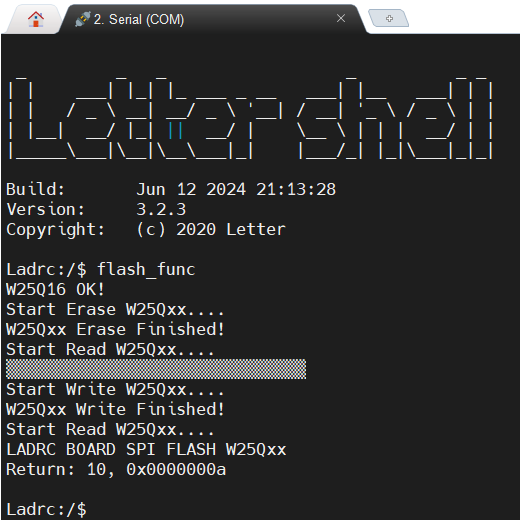
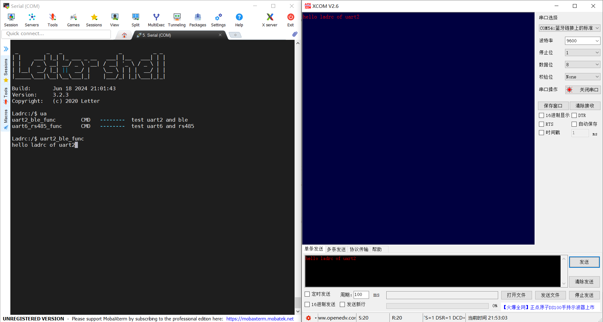
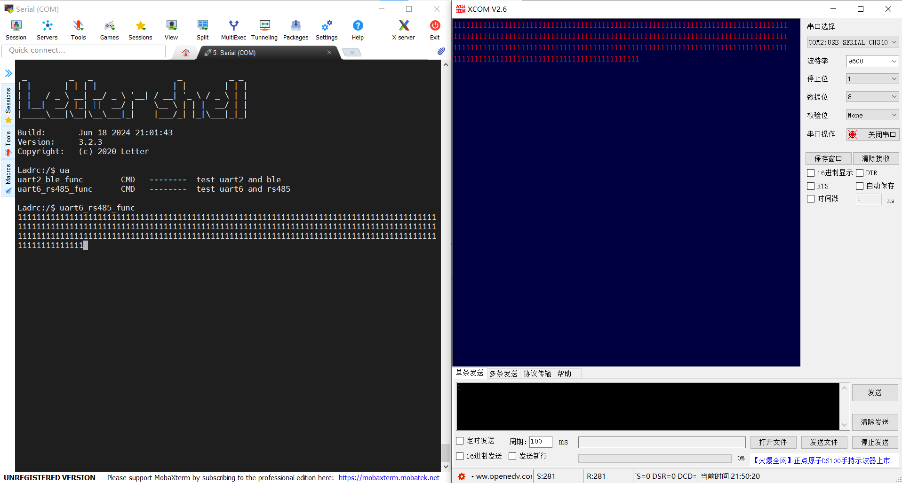

# LADRC_Board板载外设测试与API详解

[TOC]

## 简介

本文档主要介绍LADRC_Board板载外设的使用与测试示例。

## 测试用例

### 1. gpio_sample.c

1. - [x] 测试目标


   该测试用例提供了板载LED的驱动方法。使用该测试用例可测试gpio功能。

2. - [x] 硬件连接


| LED  | PIN  |
| :--: | :--: |
| LED1 | PD8  |
| LED2 | PD10 |

3. - [x] 命令说明


|   命令    |   参数1   |    示例     |
| :-------: | :-------: | :---------: |
| gpio_func | int型整数 | gpio_func 5 |

4. - [x]  测试方法


### 2.flash_sample.c

#### 2.1 测试说明

1. 测试目标

   测试板载flash(w25q16)是否正常工作，以及spi2外设是否正常，同时提供使用示例。

2. 测试接口

   | FLASH(W25Q16) | PIN(SPI) |
   | :-----------: | :------: |
   |      CS       |   PB12   |
   |      CLK      |   PB13   |
   |      DO       |   PB14   |
   |      DI       |   PB15   |

3. 命令说明

   |    命令    | 参数1 |   示例    |
   | :--------: | :---: | :-------: |
   | flash_func | NULL  | gpio_func |

4. 测试方法

   

#### 2.2 函数详解

- u16 SPI_Flash_ReadID(void);

函数功能：获取其制造商ID和设备ID。

函数说明：

```shell
1. 片选信号（/CS）拉低：
2. 将片选信号（/CS）拉低，开始SPI通信。
3. 发送命令代码：
4. 发送0x90命令代码。
5. 发送三个无效字节：
6. 发送三个0x00字节。这是为了准备读取ID。
7. 读取制造商ID和设备ID：
8. 发送0xFF，读取制造商ID（高字节）。
9. 发送0xFF，读取设备ID（低字节）。
```

-  void SPI_Flash_Erase_Sector(u32 Dst_Addr)；

函数功能：

```c
void SPI_Flash_Erase_Sector(u32 Dst_Addr)
{
    // 将目标地址乘以4096，因为一个扇区的大小是4096字节
    Dst_Addr *= 4096;

    // 使能写操作
    SPI_FLASH_Write_Enable();

    // 等待设备空闲
    SPI_Flash_Wait_Busy();

    // 将片选信号（CS）拉低，开始通信
    GPIO_WriteBit(GPIOB, GPIO_Pin_12, 0);

    // 发送扇区擦除命令
    SPI2_ReadWriteByte(W25X_SectorErase);

    // 发送目标地址的高字节
    SPI2_ReadWriteByte((u8)((Dst_Addr) >> 16));

    // 发送目标地址的中间字节
    SPI2_ReadWriteByte((u8)((Dst_Addr) >> 8));

    // 发送目标地址的低字节
    SPI2_ReadWriteByte((u8)Dst_Addr);

    // 将片选信号（CS）拉高，结束通信
    GPIO_WriteBit(GPIOB, GPIO_Pin_12, 1);

    // 等待设备空闲
    SPI_Flash_Wait_Busy();
}

/* 
说明：
扇区擦除指令将指定扇区（4K 字节）内的所有存储器设置为擦除状态，即全为1（FFh）。在设备接受扇区擦除指令之前，必须执行写使能指令（状态寄存器位 WEL 必须等于 1）。该指令通过将 /CS 引脚拉低并移入指令码“20h”以及一个 24 位的扇区地址（A23-A0）来启动。在最后一个字节的第八位被锁存后，必须将 /CS 引脚拉高。如果不这样做，扇区擦除指令将不会执行。在 /CS 被拉高后，自定时的扇区擦除指令将开始，持续时间为 tSE（参见交流特性）。在扇区擦除周期进行期间，仍然可以访问读取状态寄存器指令以检查 BUSY 位的状态。BUSY 位在扇区擦除周期期间为 1，并在周期结束且设备准备再次接受其他指令时变为 0。在扇区擦除周期结束后，状态寄存器中的写使能锁存（WEL）位被清除为 0。如果被寻址的页面被块保护（CMP、SEC、TB、BP2、BP1 和 BP0）位或单独的块/扇区锁定保护，则扇区擦除指令将不会执行。
*/
```

SPI_Flash_Wait_Busy();用于通过读寄存的方式查看当前的Flash的“忙”状态，判断其是否在忙。

-  void SPI_Flash_Read(u8 *pBuffer, u32 ReadAddr, u16 size)

```c
void SPI_Flash_Read(u8 *pBuffer, u32 ReadAddr, u16 size)
{
    u16 i;

    // 将GPIOB的12号引脚拉低，选择SPI设备
    GPIO_WriteBit(GPIOB, GPIO_Pin_12, 0);

    // 发送读取数据命令
    SPI2_ReadWriteByte(W25X_ReadData);

    // 发送读取地址的高字节
    SPI2_ReadWriteByte((u8)((ReadAddr) >> 16));

    // 发送读取地址的中字节
    SPI2_ReadWriteByte((u8)((ReadAddr) >> 8));

    // 发送读取地址的低字节
    SPI2_ReadWriteByte((u8)ReadAddr);

    // 循环读取指定长度的数据
    for(i = 0; i < size; i++)
    {
        // 读取一个字节的数据并存储在pBuffer中
        pBuffer[i] = SPI2_ReadWriteByte(0XFF);
    }

    // 将GPIOB的12号引脚拉高，取消选择SPI设备
    GPIO_WriteBit(GPIOB, GPIO_Pin_12, 1);
}

```

代码详解：

1. **启动指令**：
   - 通过将/CS引脚拉低启动指令。
   - 将指令代码“03h”与24位地址（A23-A0）移入DI引脚。
   - 代码和地址位在CLK引脚的上升沿被锁存。
2. **数据读取**：
   - 接收地址后，所寻址的内存位置的数据字节将在CLK的下降沿移出DO引脚，最高有效位（MSB）优先。
   - 地址在每个数据字节移出后自动递增，允许连续的数据流。
   - 只要时钟继续，整个内存都可以通过单个指令访问。
3. **完成指令**：
   - 通过将/CS拉高完成指令。
4. **指令忽略条件**：
   - 如果在擦除、编程或写入周期过程中（BUSY=1）发出读取数据指令，则指令将被忽略，不会对当前周期产生任何影响。

- void SPI_Flash_Write(u8 *pBuffer, u32 WriteAddr, u16 size)

```c
void SPI_Flash_Write(u8 *pBuffer, u32 WriteAddr, u16 size)
{
    u32 secpos;
    u16 secoff;
    u16 secremain;
    u16 i;

    // 计算扇区号、扇区内偏移量和扇区剩余空间
    secpos = WriteAddr / 4096; // 扇区号
    secoff = WriteAddr % 4096; // 在当前扇区的偏移
    secremain = 4096 - secoff; // 当前扇区剩余可以写的空间

    if(size <= secremain) // 如果需要写的数据少于当前扇区剩余空间
        secremain = size; // 更新剩余空间为需要写的数据量

    while(1)
    {
        // 从当前扇区读取整个扇区的数据到缓存区
        SPI_Flash_Read(SPI_FLASH_BUF, secpos * 4096, 4096);

        // 检查当前扇区需要写的数据位置是否已经擦除
        for(i = 0; i < secremain; i++)
        {
            if(SPI_FLASH_BUF[secoff + i] != 0XFF) // 如果需要写入的位置不是0xFF，表示有数据
                break;
        }

        if(i < secremain) // 当前扇区存在数据，不能直接写
        {
            // 擦除当前扇区的数据
            SPI_Flash_Erase_Sector(secpos);

            // 再次从当前扇区读取整个扇区的数据到缓存区
            SPI_Flash_Read(SPI_FLASH_BUF, secpos * 4096, 4096);

            // 将需要写的数据拷贝到缓存区的对应位置
            for(i = 0; i < secremain; i++)
            {
                SPI_FLASH_BUF[i + secoff] = pBuffer[i];
            }

            // 从头开始写整个扇区的数据
            SPI_Flash_Write_NoCheck(SPI_FLASH_BUF, secpos * 4096, 4096);
        }
        else
        {
            // 直接写入数据
            SPI_Flash_Write_NoCheck(pBuffer, WriteAddr, secremain);
        }

        if(size == secremain) // 如果剩余数据与需要写的数据数量一致
        {
            break; // 写入完成，退出循环
        }
        else
        {
            // 更新写入参数，准备写入下一个扇区
            secpos++; // 扇区号偏移
            secoff = 0; // 偏移量重置为0

            pBuffer += secremain; // 移动写缓冲区指针
            WriteAddr += secremain; // 移动写地址
            size -= secremain; // 更新剩余需要写的数据量

            if(size > 4096) // 如果剩余数据量大于一个扇区的大小
            {
                secremain = 4096; // 更新剩余空间为一个扇区的大小
            }
            else
            {
                secremain = size; // 更新剩余空间为剩余数据量
            }
        }
    }
}
```

### 3.uart2_ble_sample.c

#### 3.1 测试说明

1. 测试目标

   测试板载蓝牙模组是否正常工作，蓝牙模组采用SPP透传方式，以及uart2外设是否正常，同时提供使用示例。

2. 测试接口

   | BLE  | PIN(UART2) |
   | :--: | :--------: |
   |  TX  |    PD5     |
   |  RX  |    PD6     |

3. 命令说明

   |       命令       |   参数1   |         示例         |
   | :--------------: | :-------: | :------------------: |
   | uart2_ble_sample | int型整数 | uart2_ble_sample 100 |

   > 注：参数1：接收的字符的个数，当接收到传入参数的个数的字符后，退出当前的测试用例。

4. 测试方法

   1. 启动两个串口终端
   2. 串口终端1与板载串口shell相连，波特率115200
   3. 串口终端2与蓝牙虚拟串口相连
   4. 使用串口终端2发送字符，在串口终端1输出发送的字符，同时串口终端2回显字符

   

### 4.uart6_rs485_sample.c

#### 4.1 测试说明

1. 测试目标

   测试板载RS485是否正常工作，以及uart6外设是否正常，同时提供使用示例。

2. 测试接口

   | RS485 | PIN(UART6) |
   | :---: | :--------: |
   |  TX   |    PC0     |
   |  RX   |    PC1     |

3. 命令说明

   |        命令        |   参数1   |         示例          |
   | :----------------: | :-------: | :-------------------: |
   | uart6_rs485_sample | int型整数 | uart6_rs485_sample100 |

   > 注：参数1：接收的字符的个数，当接收到传入参数的个数的字符后，退出当前的测试用例。

4. 测试方法

   1. 启动两个串口终端
   2. 串口终端1与板载串口shell相连，波特率4800
   3. 串口终端2与蓝牙虚拟串口相连
   4. 使用串口终端2发送字符，在串口终端1输出发送的字符，同时串口终端2回显字符



### 5.i2c2_mpu6050_sample.c

#### 5.1 测试说明

1. 测试目标

   测试板载MPU6050是否正常工作，以及I2C2外设是否正常，同时提供使用示例。

2. 测试接口

   | MPU6050 | PIN(I2C2) |
   | :-----: | :-------: |
   |   SCL   |           |
   |   SDA   |           |

3. 命令说明

   |         命令          |   参数1   |           示例            |
   | :-------------------: | :-------: | :-----------------------: |
   | i2c_mpu6050_dmp_func  | int型整数 | i2c_mpu6050_dmp_func 100  |
   | i2c_mpu6050_soft_func | int型整数 | i2c_mpu6050_soft_func 100 |

   > 注：参数1：接收的字符的个数，当接收到传入参数的个数的字符后，退出当前的测试用例。

4. 测试方法

   

### 6.i2c2_mpu6050_sample.c

#### 5.1 测试说明

1. 测试目标

   测试板载MPU6050是否正常工作，以及I2C2外设是否正常，同时提供使用示例。

2. 测试接口

   | MPU6050 | PIN(I2C2) |
   | :-----: | :-------: |
   |   SCL   |           |
   |   SDA   |           |

3. 命令说明

   |         命令          |   参数1   |           示例            |
   | :-------------------: | :-------: | :-----------------------: |
   | i2c_mpu6050_dmp_func  | int型整数 | i2c_mpu6050_dmp_func 100  |
   | i2c_mpu6050_soft_func | int型整数 | i2c_mpu6050_soft_func 100 |

   > 注：参数1：接收的字符的个数，当接收到传入参数的个数的字符后，退出当前的测试用例。

4. 测试方法


### 7.spi3_lcd_st7735s_sample.c

#### 7.1 测试说明

1. 测试目标

   测试板载LCD是否正常工作，以及SPI3外设是否正常，同时提供使用示例。

2. 测试接口

   | MPU6050 | PIN(I2C2) |
   | :-----: | :-------: |
   |   CLK   |           |
   |  MOSI   |           |
   |   RES   |           |
   |   DC    |           |
   |   CS    |           |
   |   BLK   |           |

3. 命令说明

   | 命令 |   参数1   | 示例 |
   | :--: | :-------: | :--: |
   |      | int型整数 |      |

   > 注：参数1：接收的字符的个数，当接收到传入参数的个数的字符后，退出当前的测试用例。

4. 测试方法


