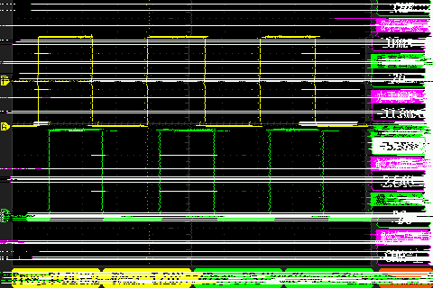
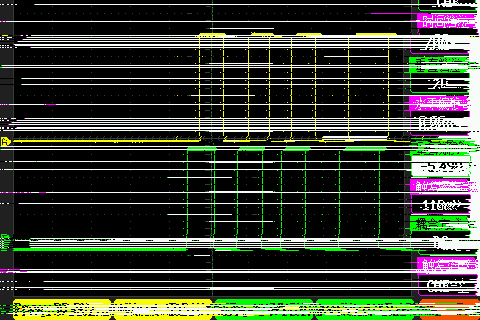

# LADRC Board - 编码器日志

[TOC]

## 简介

LADRC Board - 编码器日志；

## 调试日志

### 1.EC11正转波形图；

### 2.EC11反转波形图；

### 3.速度计算公式

#### 3.1基本参数

$$
定时器计时周期（ms）:T
$$

$$
定时器一个周期的计数: N1
$$

$$
电机减速比: P
$$

$$
轮子周长:L 半径:R
$$

$$
电机转一圈产生的脉冲个数:N2(线)
$$

$$
轮子转一圈产生的脉冲个数N:N2 * P
$$

#### 3.2速度计量单位：电机转的圈数

$$
V = N1 / N
$$

#### 3.3速度计量单位：电机转的速度

$$
V = (N1 / N)*L
$$

### 4.编码器计数模式

## 参考资料

[CSDN] : [编码器模式详解](https://blog.csdn.net/qq_38295600/article/details/130878920)

